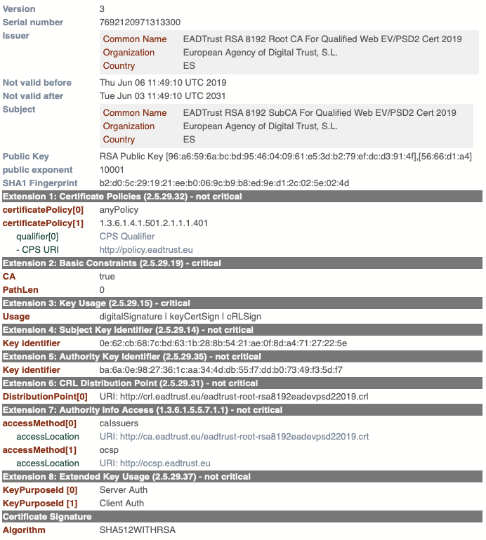

# PrintCertificate

[](https://opensource.org/licenses/Apache-2.0)

Open source library for printing X.509 certificate content

---

This library provides a a class that extends the Bouncycastle `X509CertificateHolder` class with extended printing capblities.

The output formats offered by this library are:

- Text based print (optimized for monospace or regular fonts)
- Html based print (with customizable css)
- PEM certificate format

## Usage

Instantiate the class se.idsec.utils.printcert.PrintCertificate by any of its constructors;

From byte:

```
byte[] certBytes;
PrintCertificate printCert = new PrintCertificate(certBytes);

```

From X509Certificate
```
X509Certificate x509Certificate;
PrintCertificate printCert = new PrintCertificate(x509Certificate);

```

From X509CertificateHolder
```
X509CertificateHolder x509CertificateHolder;
PrintCertificate printCert = new PrintCertificate(x509CertificateHolder);

```

The PrintCertificate objects offers print capabilities using the functions:

- toString() - for text based output
- toHtml() - for html based output
- toPEM() - for a formatted PEM certificate
- toOriginalString() - for the original X509Certificate toString() output

See javadoc for optional parameters.

### Example CSS

Example css is provided in the css folder.

## Examples
### HTML print example



### Text print example (monospace)

```
X.509 Certificate {
Version         : 3
Serial number   : fc44c9312f19db5a4f3c45191d1169cd
Issuer          :
        Country: SE
        Organization: IDsec Solutions AB
        organization Unit: Dev
        Organization ID: 1234567890
        Common Name: Test CA

Not valid before: Wed Apr 28 14:33:15 CEST 2021
Not valid after : Fri Apr 28 14:53:15 CEST 2023
Subject         :
        Country: SE
        Organization: IDsec Solutions AB
        organization Unit: The unit
        Common Name: John Doe

Public Key      : EC Public Key [0d:22:db:b9:cf:3b:fd:21:90:77:75:74:ca:8c:9c:fc:ef:8f:d7:18]
X               : ded5519dd0381b62ae3c30724f8455eafdb64ee50e5a7ccedb085c2694318b72
Y               : fffda5182d597583f945a61826eb4ec81c9b43407b81f092a9fee4345e915d77
SHA1 Fingerprint: 89:38:12:7e:c4:0d:6d:3c:da:52:e7:7a:2c:5f:76:fe:f5:a1:01:ae

Extension 1:   not critical   Basic Constraints (2.5.29.19)
  CA: false

Extension 2:   not critical   Authority Key Identifier (2.5.29.35)
  Key identifier: 9e:55:61:ea:27:7d:45:f6:4d:80:0e:22:16:02:77:75:e9:69:a6:1e:d7:3e:fe:8d:98:2d:d1:18:bb:2d:52:0c

Extension 3:   not critical   Subject Key Identifier (2.5.29.14)
  Key identifier: e2:67:11:4f:14:4c:44:7d:b6:41:4d:c7:d4:1f:dd:4b:d5:3d:46:3c:29:68:f0:b5:de:c5:55:1f:80:b8:01:f7

Extension 4:   critical   Key Usage (2.5.29.15)
  Usage: digitalSignature | keyEncipherment

Extension 5:   not critical   CRL Distribution Point (2.5.29.31)
  DistributionPoint[0]: URI: https://test-qa.ca.edelivery.digg.se/ca/crl/apca01.crl

Extension 6:   not critical   Authority Info Access (1.3.6.1.5.5.7.1.1)
  accessMethod[0] : ocsp
    accessLocation: URI: https://test-qa.ca.edelivery.digg.se/ca/ocsp/apca01

Extension 7:   not critical   Certificate Policies (2.5.29.32)
  certificatePolicy[0]: 1.2.752.201.2.1.100.1

Certificate Signature:
Algorithm: SHA256WITHRSA

}
```
